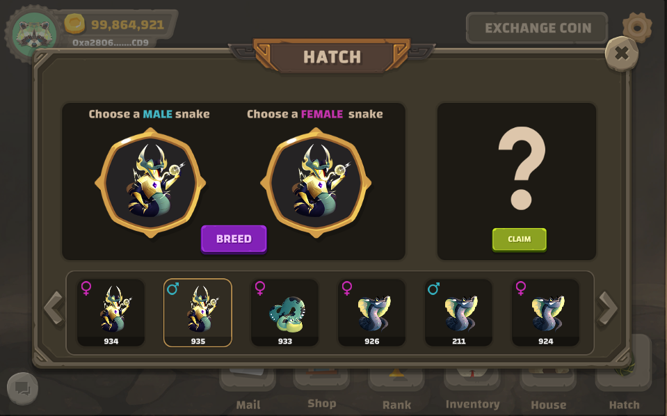

# Minigame - Hatch

🌈 Players can use 2 SNAKE of the same type (Common, Rare,...) but opposite gender to breed&#x20;

🌈 Breeding SNAKE must have full Stamina and will not be able to enter other mode while breeding&#x20;

🌈 The rarer the breeding SNAKE the longer the hatching time&#x20;

🌈 Breeding can fail. Succesful hatching will produce a SNAKE of the same type or rare

