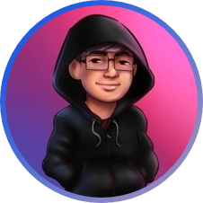
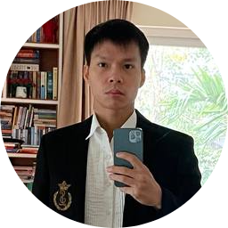
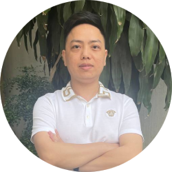
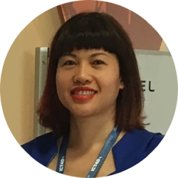
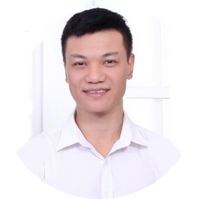
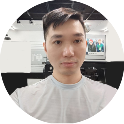

# Core team

### <mark style="color:green;">Team lead</mark>

#### <mark style="color:purple;">CK Fong</mark>

* Graduated from Temasek Polytechnic with Diploma of Telecommunication Engineering (2008)
* 8 years in Military Security Products and Testing for Singapore Technologies Engineering as Testing Engineer
* Advisory team for Online gaming security in Cambodia and Indonesia for 2 years
* 5+ years experience in Crypto projects and trading algorithm bots
* Chief Product Officer in crypto wallet investment company

#### <mark style="color:purple;">Bin</mark>

* Team leader of Teenshop Top 5 Vietnam I.T talent 2010 (E-commerce)
* Betting liquidity pool developer, 10 years+ experience
* Experienced with developing Casino products. Worked with Ezugi, top 5 casino in the world.
* 6+ years in Crypto Mining, Trading
* Vietlott Level 1 General Agent

#### <mark style="color:purple;">Morgan</mark>

* Ebank VTC (Electronic Payment)
* Exchange Market for Stock Market (SHB – Local Bank Vietnam)
* Outsource developer for “Idle Miner Tycoon”: Gold Rush (Apple Store & Google Play)

#### <mark style="color:purple;">Yen Ta  - Coo</mark>

* 11+ years of experience in managing projects funded by US, UK, and Korea governments.
* Experienced in project design, budget management, results-based reporting, and leading team.
* &#x20;Skilled and experienced in building and maintaining strong partnerships.
* High level of integrity, efficiency, enthusiasm, and excellent skills in communication, problem-solving, and staff management.

#### <mark style="color:purple;">Xavier Pham - Product Owner</mark>

* 14 years tech experience
* 7 years experience as Project Manager (PM)
* 8 years Head of Game Design
* Participated in projects: Crossfire Vietnam, Audition, World of Tanks...
*   5 years in research and development experience

#### <mark style="color:purple;">Cuong Nguyen - Head Marketing</mark>

* &#x20;7 years in marketing mmo
* 5 years mining and trading in crypto

#### <mark style="color:purple;">Trang To - Community Manager</mark>

### <mark style="color:green;">Dev Team</mark>

#### <mark style="color:blue;">Tony Nguyen</mark>

GAME TECHNICAL LEAD

15 years of experience in programming and operating

Many years of experience in working as a Technical Leader for game projects

#### <mark style="color:blue;">Xavier Pham</mark>

PROJECT OWNER

14 years tech experience

7 years experience as Project Manager (PM)

8 years Head of Game Design

#### <mark style="color:blue;">Jonson Luong</mark>

8 years tech experience

3 years of experience in Blockchain

2 years of experience in SmartContract

#### <mark style="color:blue;">Zoro Bui</mark>

8 years tech experience in Backend Game

4 years web, mobile

#### <mark style="color:blue;">Andy Nguyen</mark>

5 years of unity 3D programming

3 years of mobile game programming

#### <mark style="color:blue;">Jurgen Luong</mark>

8 years of front end

3 years of cocos creator

2 years of unity 3D programming

#### <mark style="color:blue;">Jame Phung</mark>

8 years of front end

2 years of cocos creator

2 years of mobile game programming

#### <mark style="color:blue;">Warren Nguyen</mark>

8 years of front end

2 years of mobile game programming
